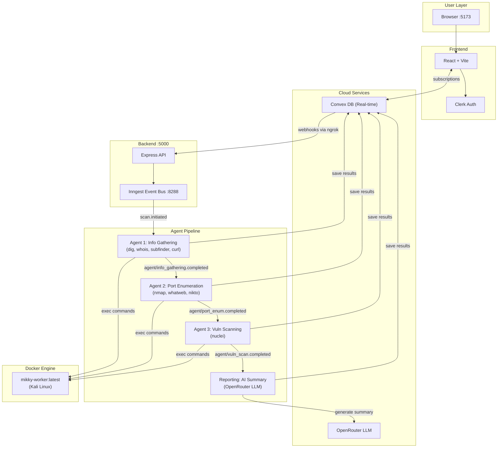

<p align="center">
  
  
  
  
</p>

<h1 align="center">MIKKY OS</h1>
<h3 align="center">AI-Powered Offensive Security Operations Center</h3>

<p align="center">
  <i>"The Matrix has you... unless you hack it first."</i>
</p>

<p align="center">
  Autonomous penetration testing platform that chains AI agents with Kali Linux containers<br/>
  to perform recon, enumeration, vulnerability scanning, and AI-driven reporting.
</p>

---

## Table of Contents

- [Overview](#overview)
- [Architecture](#architecture)
- [Tech Stack](#tech-stack)
- [Prerequisites](#prerequisites)
- [Quick Start (for Professionals)](#quick-start-for-professionals)
- [AI Agent Setup Prompt (for Vibe Coders)](#ai-agent-setup-prompt-for-vibe-coders)
- [Full Setup Guide (Step-by-Step)](#full-setup-guide-step-by-step)
  - [Step 1: Install Required Software](#step-1-install-required-software)
  - [Step 2: Clone & Install Dependencies](#step-2-clone--install-dependencies)
  - [Step 3: Create Accounts & Get API Keys](#step-3-create-accounts--get-api-keys)
  - [Step 4: Set Up Convex Database](#step-4-set-up-convex-database)
  - [Step 5: Configure Environment Files](#step-5-configure-environment-files)
  - [Step 6: Build the Docker Image](#step-6-build-the-docker-image)
  - [Step 7: Start Ngrok Tunnel](#step-7-start-ngrok-tunnel)
  - [Step 8: Launch the System](#step-8-launch-the-system)
  - [Step 9: Verify Everything Works](#step-9-verify-everything-works)
- [Environment Variables Reference](#environment-variables-reference)
- [Port Allocation](#port-allocation)
- [Project Structure](#project-structure)
- [Common Issues & Troubleshooting](#common-issues--troubleshooting)
- [Features](#features)
- [License](#license)

---

## Overview

Mikky OS orchestrates a multi-agent scan pipeline that runs security tools inside ephemeral Kali Linux Docker containers. An Inngest event bus chains three specialized agents (Recon, Enumeration, Vulnerability Scan) plus an AI reporting stage. Results stream in real-time to a React dashboard via Convex subscriptions.

```
You (Browser) ──> React Frontend ──> Convex DB <──subscriptions──> Dashboard
                                        │
                                        ▼ (webhooks via ngrok)
                                   Express Backend
                                        │
                              ┌─────────┴─────────┐
                              ▼                    ▼
                        Inngest Bus          Docker Engine
                              │                    │
                   ┌──────────┼──────────┐         │
                   ▼          ▼          ▼         ▼
              Agent 1    Agent 2    Agent 3   Kali Container
              (Recon)    (Enum)    (Vuln)    (nmap, nuclei...)
                   │          │          │
                   └──────────┴──────────┘
                              │
                              ▼
                     AI Reporting Stage
                      (OpenRouter LLM)
```

---

## Architecture



---

## Tech Stack

| Layer | Technology | Purpose |
|:------|:-----------|:--------|
| **Frontend** | React 19, Vite 7, TypeScript | Single-page application |
| **Styling** | Tailwind CSS v4, Framer Motion | Cyberpunk / Stealth theming |
| **Auth** | Clerk | User authentication & sessions |
| **Database** | Convex | Real-time subscriptions & storage |
| **Backend** | Node.js, Express 5 | REST API & webhook handler |
| **Orchestration** | Inngest | Durable event-driven agent pipeline |
| **AI / LLM** | OpenRouter (Gemini, DeepSeek) | Vuln analysis, report generation |
| **Security Tools** | Docker + Kali Linux | nmap, nuclei, subfinder, nikto, gobuster, sqlmap, hydra, metasploit, and more |
| **Tunnel** | Ngrok | Exposes local backend to Convex cloud |

---

## Prerequisites

> **Summary:** You need Node.js, Git, Docker Desktop, and Ngrok installed, plus free accounts on Convex, Clerk, OpenRouter, and Ngrok.

| Tool | What It Is | Download |
|:-----|:-----------|:---------|
| **Node.js** (v18+) | JavaScript runtime that powers the app | [nodejs.org](https://nodejs.org/) &mdash; choose **LTS** |
| **Git** | Version control to download the code | [git-scm.com](https://git-scm.com/downloads) |
| **Docker Desktop** | Runs the Kali Linux security containers | [docker.com](https://www.docker.com/products/docker-desktop/) |
| **Ngrok** | Creates a public tunnel to your local backend | [ngrok.com/download](https://ngrok.com/download) |

| Service | What It Does | Sign Up |
|:--------|:-------------|:--------|
| **Convex** | Real-time database | [convex.dev](https://www.convex.dev/) (free tier) |
| **Clerk** | User authentication | [clerk.com](https://clerk.com/) (free tier) |
| **OpenRouter** | AI model access (LLM) | [openrouter.ai](https://openrouter.ai/) (has free models) |
| **Ngrok** | Tunnel auth token | [ngrok.com](https://ngrok.com/) (free tier) |

---

## Quick Start (for Professionals)

> Already have Node.js, Git, Docker, and Ngrok installed? Here's the fast track.

```bash
# Clone & install
git clone https://github.com/Neoujne/mikky-os.git && cd mikky-os
npm install && cd mikky-os-backend && npm install && cd ../mikky-os-frontend && npm install && cd ..

# Init Convex (follow prompts, keep running)
cd mikky-os-frontend && npx convex dev
# -> Note the CONVEX_URL from .env.local

# In a new terminal — configure backend
cd mikky-os-backend && cp ../.env.example .env
# Edit .env → set CONVEX_URL, OPENROUTER_API_KEY

# Build Docker image (first time only, ~15 min)
cd ../mikky-os-worker && docker build -t mikky-worker:latest .

# Start ngrok tunnel (new terminal, keep running)
ngrok http 5000
# -> Copy forwarding URL (e.g. https://abc123.ngrok-free.app)

# Tell Convex about your tunnel
cd mikky-os-frontend && npx convex env set MIKKY_BACKEND_URL https://abc123.ngrok-free.app && cd ..

# Configure frontend .env.local (if not auto-generated)
# VITE_CONVEX_URL=<your convex url>
# VITE_CLERK_PUBLISHABLE_KEY=<from clerk dashboard>
# VITE_MIKKY_BACKEND_URL=http://localhost:5000

# Launch everything
npm run dev:all

# Open http://localhost:5173
```

**Terminals needed:** 3 (Convex dev, Ngrok, dev:all)

---

## AI Agent Setup Prompt (for Vibe Coders)

> Copy the prompt below and give it to your AI coding agent (Cursor, Windsurf, Claude Code, etc.).
> The agent will handle all the automated steps. **You only need to do the manual steps listed after the prompt.**

```text
I need you to set up the "Mikky OS" project for local development. Here is the repo:
https://github.com/Neoujne/mikky-os.git

AUTOMATED STEPS (do these for me):

1. Clone the repo and cd into it.
2. Run "npm install" in the root directory.
3. Run "npm install" inside "mikky-os-backend/".
4. Run "npm install" inside "mikky-os-frontend/".
5. In "mikky-os-backend/", copy "../.env.example" to ".env".
6. I will provide env values shortly — leave placeholders for now.
7. Check if Docker is running. If so, build the worker image:
   cd mikky-os-worker && docker build -t mikky-worker:latest .
8. Check if "mikky-os-frontend/.env.local" exists. If not, create it with these keys:
   CONVEX_DEPLOYMENT=
   VITE_CONVEX_URL=
   VITE_CLERK_PUBLISHABLE_KEY=
   VITE_MIKKY_BACKEND_URL=http://localhost:5000
9. Do NOT start any dev servers yet — I need to do manual steps first.

TELL ME when you're done so I can do the manual steps.
```

### Manual Steps You Must Do Yourself

After your agent finishes, complete these steps:

| # | Action | Where | What to Copy |
|:--|:-------|:------|:-------------|
| 1 | **Create a Convex account** | [convex.dev](https://www.convex.dev/) | Sign up with GitHub |
| 2 | **Initialize Convex** | Terminal inside `mikky-os-frontend/` | Run `npx convex dev`, follow prompts, note the `CONVEX_URL` |
| 3 | **Create a Clerk account** | [clerk.com](https://clerk.com/) | Create an app, copy `Publishable Key` |
| 4 | **Create an OpenRouter account** | [openrouter.ai](https://openrouter.ai/) | Go to Keys, create an API key |
| 5 | **Sign up for Ngrok** | [ngrok.com](https://ngrok.com/) | Copy your auth token, run `ngrok config add-authtoken <token>` |
| 6 | **Fill in `mikky-os-backend/.env`** | Your editor | Set `CONVEX_URL` and `OPENROUTER_API_KEY` |
| 7 | **Fill in `mikky-os-frontend/.env.local`** | Your editor | Set `VITE_CONVEX_URL`, `VITE_CLERK_PUBLISHABLE_KEY` |
| 8 | **Start Ngrok** | New terminal | Run `ngrok http 5000`, copy the https URL |
| 9 | **Set backend URL in Convex** | Terminal in `mikky-os-frontend/` | `npx convex env set MIKKY_BACKEND_URL <ngrok-url>` |
| 10 | **Launch the app** | Root terminal | `npm run dev:all` |
| 11 | **Open the app** | Browser | Go to `http://localhost:5173` |

---

## Full Setup Guide (Step-by-Step)

> This section is for anyone, even if you've never coded before. Follow every step in order.

---

### Step 1: Install Required Software

You need four programs installed on your computer. If you already have any of them, skip to the next.

#### 1.1: Install Node.js

Node.js is the engine that runs Mikky OS.

1. Go to [https://nodejs.org](https://nodejs.org/)
2. Click the **LTS** (Long Term Support) button to download
3. Run the installer &mdash; accept all defaults, click Next/Finish
4. **Verify:** Open a terminal and type:
   ```bash
   node -v
   ```
   You should see something like `v22.x.x`. Any version **18 or above** works.

> **What is a terminal?**
> - **Windows:** Press `Win + R`, type `cmd`, press Enter. Or search for "Terminal" in the Start menu.
> - **Mac:** Press `Cmd + Space`, type "Terminal", press Enter.
> - **Linux:** Press `Ctrl + Alt + T`.

#### 1.2: Install Git

Git lets you download the source code.

1. Go to [https://git-scm.com/downloads](https://git-scm.com/downloads)
2. Download for your OS and run the installer (accept defaults)
3. **Verify:**
   ```bash
   git --version
   ```

#### 1.3: Install Docker Desktop

Docker runs the Kali Linux security scanner containers.

1. Go to [https://www.docker.com/products/docker-desktop/](https://www.docker.com/products/docker-desktop/)
2. Download and install for your OS
3. **Open Docker Desktop** after installing &mdash; it needs to be running in the background
4. **Verify:**
   ```bash
   docker --version
   ```

> **Important:** Docker Desktop must be **running** whenever you use Mikky OS. You'll see a whale icon in your system tray.

#### 1.4: Install Ngrok

Ngrok creates a tunnel so the cloud database can talk to your local backend.

1. Go to [https://ngrok.com/download](https://ngrok.com/download)
2. Sign up for a free account
3. Download and install Ngrok for your OS
4. Copy your **auth token** from the Ngrok dashboard
5. Run this command to authenticate:
   ```bash
   ngrok config add-authtoken YOUR_TOKEN_HERE
   ```
6. **Verify:**
   ```bash
   ngrok version
   ```

---

### Step 2: Clone & Install Dependencies

Open a terminal and run these commands one by one:

```bash
# Download the code
git clone https://github.com/Neoujne/mikky-os.git

# Enter the project folder
cd mikky-os

# Install root dependencies
npm install

# Install backend dependencies
cd mikky-os-backend
npm install

# Go back to root and install frontend dependencies
cd ../mikky-os-frontend
npm install

# Go back to root
cd ..
```

> **What does `npm install` do?** It downloads all the libraries the project needs. Think of it like installing apps on your phone.

---

### Step 3: Create Accounts & Get API Keys

Mikky OS uses three cloud services. All have free tiers.

#### 3.1: Convex (Database)

1. Go to [https://www.convex.dev](https://www.convex.dev/)
2. Click **"Get Started"** and sign up (GitHub login is easiest)
3. You don't need to create a project yet &mdash; we'll do that in Step 4

#### 3.2: Clerk (Authentication)

1. Go to [https://clerk.com](https://clerk.com/)
2. Sign up and create a new **Application**
3. Name it anything (e.g., "Mikky OS")
4. In your Clerk dashboard, find these keys:
   - **Publishable Key** &mdash; starts with `pk_test_...`

   Save this somewhere, you'll need it in Step 5.

#### 3.3: OpenRouter (AI)

1. Go to [https://openrouter.ai](https://openrouter.ai/)
2. Sign up and go to **Keys** in the menu
3. Click **"Create Key"** and name it (e.g., "Mikky OS")
4. Copy the key &mdash; it starts with `sk-or-v1-...`

   Save this somewhere, you'll need it in Step 5.

> **Cost:** OpenRouter has free models available. The default model (`google/gemini-2.0-flash-exp:free`) is free to use. You can change to paid models later for better results.

---

### Step 4: Set Up Convex Database

This step initializes your database. You need a **dedicated terminal** for this.

1. Open a **new terminal** (call it **Terminal 1 &mdash; Convex**)
2. Navigate to the frontend folder:
   ```bash
   cd mikky-os/mikky-os-frontend
   ```
3. Run:
   ```bash
   npx convex dev
   ```
4. It will ask you to log in and create a project &mdash; follow the prompts
5. Once running, it will create a file called `.env.local` in the frontend folder
6. **Find your `CONVEX_URL`** &mdash; either:
   - Look at the terminal output, or
   - Open `mikky-os-frontend/.env.local` and find the line `VITE_CONVEX_URL=https://...`
7. **Copy that URL** (e.g., `https://some-animal-123.convex.cloud`)

> **Keep this terminal running!** Convex dev server must stay active during development.

---

### Step 5: Configure Environment Files

Environment files tell the app your secret keys. You need two files.

#### 5.1: Backend `.env`

1. Open a **new terminal** (call it **Terminal 2 &mdash; Main**)
2. Navigate to the backend:
   ```bash
   cd mikky-os/mikky-os-backend
   ```
3. Create the `.env` file from the template:
   ```bash
   cp ../.env.example .env
   ```
4. Open the `.env` file in any text editor and fill it in:

   ```env
   PORT=5000
   MIKKY_SECRET_KEY=dev-secret-key
   OPENROUTER_API_KEY=sk-or-v1-PASTE_YOUR_KEY_HERE
   OPENROUTER_MODEL=google/gemini-2.0-flash-exp:free
   CONVEX_URL=https://PASTE_YOUR_CONVEX_URL_HERE
   CLERK_PUBLISHABLE_KEY=
   CLERK_SECRET_KEY=
   ```

   | Variable | What to Put | Required? |
   |:---------|:------------|:---------:|
   | `PORT` | `5000` (leave as is) | Yes |
   | `MIKKY_SECRET_KEY` | Any random string (e.g., `my-secret-123`) | Yes |
   | `OPENROUTER_API_KEY` | Your OpenRouter key from Step 3.3 | Yes |
   | `OPENROUTER_MODEL` | Leave default or change to a model you prefer | Yes |
   | `CONVEX_URL` | The URL from Step 4 | Yes |
   | `CLERK_PUBLISHABLE_KEY` | Your Clerk key from Step 3.2 | Optional |
   | `CLERK_SECRET_KEY` | From Clerk dashboard | Optional |

5. Save and close the file.

#### 5.2: Frontend `.env.local`

The Convex setup (Step 4) should have already created this file. Let's verify and complete it.

1. Open `mikky-os-frontend/.env.local` in a text editor
2. Make sure it has all of these lines:

   ```env
   CONVEX_DEPLOYMENT=dev:your-project-name
   VITE_CONVEX_URL=https://your-convex-url.convex.cloud
   VITE_CLERK_PUBLISHABLE_KEY=pk_test_PASTE_YOUR_KEY_HERE
   VITE_MIKKY_BACKEND_URL=http://localhost:5000
   ```

   | Variable | What to Put | Required? |
   |:---------|:------------|:---------:|
   | `CONVEX_DEPLOYMENT` | Auto-filled by Convex &mdash; don't change | Yes |
   | `VITE_CONVEX_URL` | Auto-filled by Convex &mdash; don't change | Yes |
   | `VITE_CLERK_PUBLISHABLE_KEY` | Your Clerk publishable key from Step 3.2 | Yes |
   | `VITE_MIKKY_BACKEND_URL` | `http://localhost:5000` for now | Yes |

3. Save and close the file.

---

### Step 6: Build the Docker Image

This builds the Kali Linux container with all the security tools. It's a one-time step (takes ~15-30 minutes depending on your internet).

1. Make sure **Docker Desktop is running** (check for the whale icon in your system tray)
2. In **Terminal 2**, run:
   ```bash
   cd ../mikky-os-worker
   docker build -t mikky-worker:latest .
   ```
3. Wait for it to finish. You'll see `Successfully tagged mikky-worker:latest` at the end.

> **This downloads ~8 GB** of security tools. Make sure you have enough disk space and a stable internet connection.

---

### Step 7: Start Ngrok Tunnel

Convex runs in the cloud and needs to reach your local backend. Ngrok creates that bridge.

1. Open a **new terminal** (call it **Terminal 3 &mdash; Ngrok**)
2. Run:
   ```bash
   ngrok http 5000
   ```
3. You'll see output like this:
   ```
   Forwarding   https://a1b2-c3d4.ngrok-free.app -> http://localhost:5000
   ```
4. **Copy the `https://...` URL** (e.g., `https://a1b2-c3d4.ngrok-free.app`)

> **Keep this terminal running!** If you close it, the tunnel dies and Convex can't reach your backend.

5. Now tell Convex about your tunnel. In **Terminal 2**, run:
   ```bash
   cd ../mikky-os-frontend
   npx convex env set MIKKY_BACKEND_URL https://PASTE_YOUR_NGROK_URL_HERE
   cd ..
   ```

> **Note:** The Ngrok URL changes every time you restart Ngrok (on the free plan). You'll need to repeat this `convex env set` step each time.

---

### Step 8: Launch the System

You should now have **Terminal 1 (Convex)** and **Terminal 3 (Ngrok)** running.

In **Terminal 2**, from the project root (`mikky-os/`):

```bash
npm run dev:all
```

This starts four services at once:

| Service | Port | What It Does |
|:--------|:-----|:-------------|
| Convex Dev | cloud | Watches for database schema changes |
| Frontend (Vite) | `5173` | The web UI you see in the browser |
| Backend (Express) | `5000` | API server that talks to Docker & AI |
| Inngest Dev | `8288` | Event bus that coordinates the agents |

---

### Step 9: Verify Everything Works

Open your browser and check each of these:

| Check | URL | Expected Result |
|:------|:----|:----------------|
| Frontend | [http://localhost:5173](http://localhost:5173) | Mikky OS login/dashboard appears |
| Backend | [http://localhost:5000](http://localhost:5000) | Shows "MIKKY OS Backend is ONLINE" |
| Backend Health | [http://localhost:5000/api/health](http://localhost:5000/api/health) | JSON response with Docker status |
| Inngest Dashboard | [http://localhost:8288](http://localhost:8288) | Inngest dev UI with registered functions |

If all four work, **congratulations &mdash; Mikky OS is running!**

---

## Environment Variables Reference

### Backend (`mikky-os-backend/.env`)

| Variable | Description | Default | Required |
|:---------|:------------|:--------|:--------:|
| `PORT` | Backend server port | `5000` | Yes |
| `MIKKY_SECRET_KEY` | Secret for backend auth | `dev-secret-key` | Yes |
| `OPENROUTER_API_KEY` | OpenRouter API key | &mdash; | Yes |
| `OPENROUTER_MODEL` | LLM model ID | `google/gemini-2.0-flash-exp:free` | Yes |
| `CONVEX_URL` | Convex deployment URL | &mdash; | Yes |
| `CLERK_PUBLISHABLE_KEY` | Clerk public key | &mdash; | Optional |
| `CLERK_SECRET_KEY` | Clerk secret key | &mdash; | Optional |

### Frontend (`mikky-os-frontend/.env.local`)

| Variable | Description | Default | Required |
|:---------|:------------|:--------|:--------:|
| `CONVEX_DEPLOYMENT` | Convex deployment name | Auto-generated | Yes |
| `VITE_CONVEX_URL` | Convex URL for client | Auto-generated | Yes |
| `VITE_CLERK_PUBLISHABLE_KEY` | Clerk publishable key | &mdash; | Yes |
| `VITE_MIKKY_BACKEND_URL` | Backend URL for API calls | `http://localhost:5000` | Yes |

### Convex Cloud Environment

| Variable | Description | Set Via |
|:---------|:------------|:--------|
| `MIKKY_BACKEND_URL` | Ngrok tunnel URL to your backend | `npx convex env set MIKKY_BACKEND_URL <url>` |

---

## Port Allocation

| Service | Port | Protocol |
|:--------|:-----|:---------|
| Frontend (Vite) | `5173` | HTTP |
| Backend (Express) | `5000` | HTTP |
| Inngest Dev Server | `8288` | HTTP |
| Convex | Cloud-hosted | HTTPS |
| Ngrok | Dynamic | HTTPS &rarr; `localhost:5000` |

---

## Project Structure

```
mikky-os/
├── mikky-os-frontend/          # React SPA
│   ├── src/
│   │   ├── pages/              # Route pages (Dashboard, Targets, Vulns, Intel...)
│   │   ├── components/         # UI components (terminal, shell, vulns, reports...)
│   │   └── App.tsx             # Router & auth wrappers
│   ├── convex/                 # Convex schema & server functions
│   │   ├── schema.ts           # Database table definitions
│   │   ├── scans.ts            # Scan CRUD operations
│   │   ├── targets.ts          # Target management
│   │   ├── vulnerabilities.ts  # Vulnerability records
│   │   └── intel.ts            # Intelligence data
│   └── .env.local              # Frontend env config
│
├── mikky-os-backend/           # Express API + Agent Pipeline
│   ├── src/
│   │   ├── index.ts            # Express server & all REST routes
│   │   ├── inngest/
│   │   │   ├── client.ts       # Inngest client singleton
│   │   │   ├── functions.ts    # Function registry (imports only!)
│   │   │   ├── agent.ts        # ReAct loop for CLI agent
│   │   │   └── agents/         # Pipeline agents
│   │   │       ├── agent1-info-gathering.ts   # Recon (dig, whois, subfinder)
│   │   │       ├── agent2-port-enum.ts        # Enumeration (nmap, whatweb)
│   │   │       ├── agent3-vuln-scan.ts        # Scanning (nuclei)
│   │   │       ├── reporting.ts               # AI summary & scoring
│   │   │       └── shared.ts                  # Shared helpers & parsers
│   │   └── lib/
│   │       ├── docker.ts       # WorkerManager (container lifecycle)
│   │       ├── llm.ts          # OpenRouter LLM wrapper
│   │       ├── tools.ts        # Agent tool definitions & executor
│   │       ├── convex.ts       # Convex HTTP client
│   │       └── validators.ts   # Input sanitization
│   └── .env                    # Backend env config
│
├── mikky-os-worker/            # Docker Security Container
│   └── Dockerfile              # Kali Linux + security tools
│
├── .env.example                # Env template
├── package.json                # Root scripts (dev:all, etc.)
└── README.md                   # You are here
```

---

## Common Issues & Troubleshooting

<details>
<summary><strong>"CONVEX_URL environment variable is not set"</strong></summary>

Your backend can't find the Convex URL.

**Fix:** Open `mikky-os-backend/.env` and make sure `CONVEX_URL` is set to the URL from `mikky-os-frontend/.env.local` (`VITE_CONVEX_URL` value).
</details>

<details>
<summary><strong>"Docker image 'mikky-worker:latest' not found"</strong></summary>

The security container hasn't been built yet.

**Fix:**
```bash
cd mikky-os-worker
docker build -t mikky-worker:latest .
```
</details>

<details>
<summary><strong>Frontend shows a blank page or auth error</strong></summary>

Clerk keys might be missing or wrong.

**Fix:** Check that `mikky-os-frontend/.env.local` has `VITE_CLERK_PUBLISHABLE_KEY` set correctly. It should start with `pk_test_`.
</details>

<details>
<summary><strong>Scans start but never complete / no results</strong></summary>

The Convex-to-backend webhook might not be reaching your machine.

**Fix:**
1. Make sure Ngrok is running: `ngrok http 5000`
2. Update Convex with the new URL: `npx convex env set MIKKY_BACKEND_URL <ngrok-url>`
3. Check that the backend is running on port 5000
</details>

<details>
<summary><strong>"Port 5000 already in use"</strong></summary>

Another process is using port 5000.

**Fix (Mac):**
```bash
lsof -i :5000
kill -9 <PID>
```
**Fix (Windows):**
```bash
netstat -ano | findstr :5000
taskkill /PID <PID> /F
```
</details>

<details>
<summary><strong>Ngrok URL changed and scans stopped working</strong></summary>

Free Ngrok gives a new URL every restart.

**Fix:** Every time you restart Ngrok:
```bash
cd mikky-os-frontend
npx convex env set MIKKY_BACKEND_URL https://NEW_NGROK_URL_HERE
```
</details>

<details>
<summary><strong>Docker build fails / takes too long</strong></summary>

The Kali image is large (~8 GB).

**Fix:**
- Make sure Docker Desktop is running and has enough disk space (15+ GB free)
- Use a stable internet connection
- If it fails mid-way, run the build command again &mdash; Docker caches completed layers
</details>

---

## Features

### Network Recon & Surveillance
Orchestrates **Nmap**, **Subfinder**, **dig**, **whois**, and **curl** to map attack surfaces. Results stream live to your dashboard.

### Port Enumeration
Runs **Nmap** service/version detection, **WhatWeb** fingerprinting, and **Nikto** web scanning. Discovers open ports, services, and technologies.

### Vulnerability Scanning
Integrated **Nuclei** engine detects CVEs, misconfigurations, and exposed panels. Findings are categorized by severity (Critical, High, Medium, Low, Info).

### AI-Powered Reporting
An LLM analyzes all scan data and generates executive summaries, risk scores, and prioritized remediation steps.

### Real-Time Dashboard
Watch scans progress in real-time through Convex subscriptions. View targets, scan history, vulnerabilities, and intelligence data from one place.

### Interactive Terminal
Built-in terminal emulator for direct command execution inside Docker containers.

---

## License

MIT

---

<p align="center">
  <sub>Built for the Vibeathon &mdash; hacking the planet, one repo at a time.</sub>
</p>
